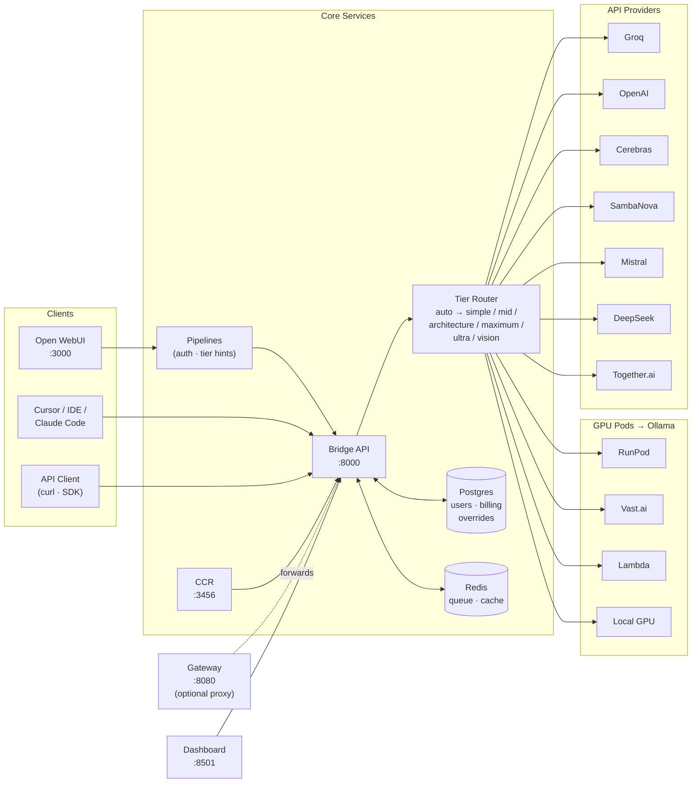

# Architecture

```mermaid
flowchart LR
    subgraph clients["Clients"]
        OWU["Open WebUI\n:3000"]
        IDE["Cursor / IDE /\nClaude Code"]
        CLI["API Client\n(curl · SDK)"]
    end

    subgraph core["Core Services"]
        Pipeline["Pipelines\n(auth · tier hints)"]
        Bridge["Bridge API\n:8000"]
        Router["Tier Router\nauto → simple / mid /\narchitecture / maximum /\nultra / vision"]
        CCR["CCR\n:3456"]
        PG[("Postgres\nusers · billing\noverrides")]
        Redis[("Redis\nqueue · cache")]
    end

    subgraph pods["GPU Pods → Ollama"]
        RunPod["RunPod"]
        Vast["Vast.ai"]
        Lambda["Lambda"]
        LocalGPU["Local GPU"]
    end

    subgraph apis["API Providers"]
        Groq["Groq"]
        OpenAI["OpenAI"]
        Cerebras["Cerebras"]
        SambaNova["SambaNova"]
        Mistral["Mistral"]
        DeepSeek["DeepSeek"]
        Together["Together.ai"]
    end

    Dashboard["Dashboard\n:8501"]
    Gateway["Gateway\n:8080\n(optional proxy)"]

    OWU --> Pipeline --> Bridge
    IDE & CLI --> Bridge
    CCR --> Bridge
    Gateway -. "forwards" .-> Bridge
    Bridge <--> PG
    Bridge <--> Redis
    Bridge --> Router
    Router --> RunPod & Vast & Lambda & LocalGPU
    Router --> Groq & OpenAI & Cerebras & SambaNova & Mistral & DeepSeek & Together
    Dashboard --> Bridge
```
